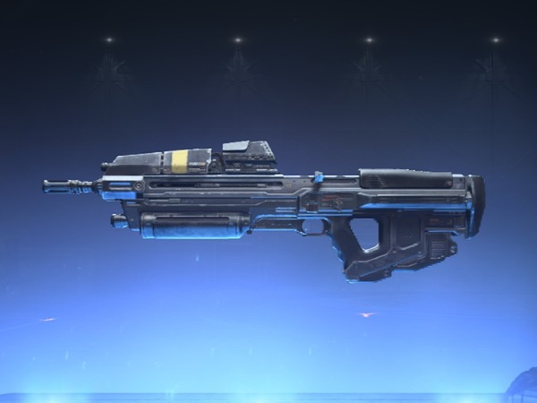
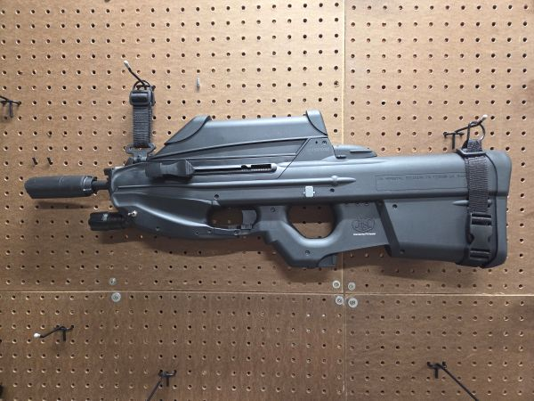
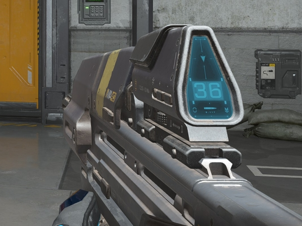
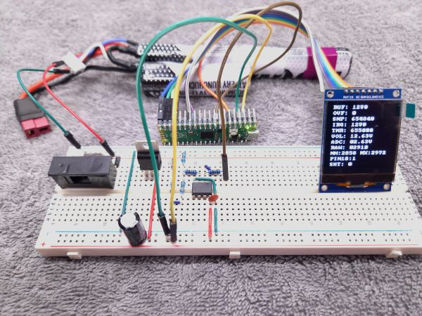

# Airsoft Display - Smart Shot Counter & Battery Monitor

[](https://creativecommons.org/licenses/by-nc/4.0/)
[](https://www.raspberrypi.com/products/raspberry-pi-pico/)
[](https://isocpp.org/)


A real-time shot counter and battery monitor for airsoft guns built with the Raspberry Pi Pico (RP2040). Features a custom OLED display driver, high-speed ADC sampling with DMA, and dual-core architecture for parallel data acquisition and display rendering.

## About This Repository

This is an embedded hardware project for use with an F2000 model airsoft rifle. It's a bullpup style, reminiscent of Halo weapons like the BR55 Battle Rifle and MA40 Assault Rifle, both of which have built-in displays with ammo counters. The device is unique compared to others built by makers because it is powered by the main airsoft gun LiPo battery through its balance charging port. This also forms the basis for the shot counting and battery voltage monitoring features. It samples the battery voltage at 5kHz, providing a stream of data to an algorithm that detects when shots are fired based on voltage drops. Overall, it's an efficient design that does not require any external sensors or a secondary power supply.

\- Xtrom

## Photos

<table>
  <tr>
    <td align="center">
      <h2>Inspiration</h2>(Halo)
    </td>
    <td align="center" style="font-size: 2em;">&rarr;</td>
    <td align="center">
      <h2>Project</h2>(Airsoft)
    </td>
  </tr>
  <tr>
    <td align="center">
      <br>
      <b>Halo MA40 Assault Rifle</b>
    </td>
    <td align="center" style="font-size: 2em;">&rarr;</td>
    <td align="center">
      <br>
      <b>F2000 Airsoft Rifle</b>
    </td>
  </tr>
  <tr>
    <td align="center">
      <br>
      <b>MA40 Display</b>
    </td>
    <td align="center" style="font-size: 2em;">&rarr;</td>
    <td align="center">
      <br>
      <b>F2000 Display (WIP)</b>
    </td>
  </tr>
</table>

## 🎯 Features

### Current Implementation
- ✅ **Custom SH1107 OLED Driver** - Built from scratch with full graphics primitives
- ✅ **Dual-Core Architecture** - Parallel processing for display and data acquisition
- ✅ **High-Speed DMA Sampling** - 5 kHz ADC sampling with hardware DMA
- ✅ **Digital Signal Processing** - Two-stage voltage filtering (median + low-pass)
- ✅ **Data Collection System** - Record and analyze voltage data for algorithm development
- ✅ **Real-Time Monitoring** - Live voltage display with filtering statistics

### Planned Features
- 🚧 **Shot Detection Algorithm** - Voltage dip detection for counting shots
- 🚧 **Button Input** - Long-press reset for shot counter
- 🚧 **Battery Alerts** - Low voltage warnings
- 🚧 **Voltage History Graph** - Visual trend display

## 🛠️ Hardware

### Components
- **Microcontroller:** Raspberry Pi Pico (RP2040)
- **Display:** SH1107 128x128 OLED (SPI mode)
- **Power:** L7805CV voltage regulator (5V, 1A)
- **Battery:** 11.1V 3S LiPo (airsoft standard)
- **Voltage Divider:** 1kΩ and 3kΩ resistors
- **Signal Buffer:** Opamp buffer for clean signal

### Pin Configuration

| Component | Signal | Pico Pin | GPIO | Notes |
|-----------|--------|----------|------|-------|
| **SH1107 Display** | SCK (Clock) | Pin 19 | GP14 | SPI1 Clock |
| | MOSI (Data) | Pin 20 | GP15 | SPI1 MOSI |
| | DC (Data/Command) | Pin 27 | GP21 | Command/Data select |
| | CS (Chip Select) | Pin 17 | GP13 | SPI Chip Select |
| | RST (Reset) | Pin 26 | GP20 | Display Reset |
| **Battery Monitor** | ADC Input | Pin 31 | GP26 | ADC0 |
| **Status LED** | Onboard LED | Pin 30 | GP25 | Built-in LED |

See [docs/hardware/circuit-description.md](docs/hardware/circuit-description.md) for detailed schematics.

## 🚀 Getting Started

### Prerequisites

#### Required Tools
- [Raspberry Pi Pico SDK](https://github.com/raspberrypi/pico-sdk) (v2.1.1+)
- CMake (3.13+)
- GCC ARM Embedded Toolchain (14.2+)
- Python 3.8+ (for data analysis tools)

#### Optional Tools
- VS Code with Pico extension
- Serial terminal (for debugging)

### Building the Project

```bash
# Clone the repository
git clone https://github.com/XtromAI/airsoft-display.git
cd airsoft-display

# Build with CMake
mkdir build
cd build
cmake ..
make -j4

# Flash to Pico (hold BOOTSEL button, connect USB)
cp airsoft-display.uf2 /media/$USER/RPI-RP2/
```

### Development with VS Code

1. Install the Raspberry Pi Pico extension
2. Open the project folder
3. Use the "Compile Project" task (Ctrl+Shift+B)
4. Use the "Flash" task to upload firmware

**Note:** Do not use the "Run Project" task - see [copilot-instructions.md](.github/copilot-instructions.md) for details.

## 📊 Data Collection

The project includes tools for collecting and analyzing real-world voltage data:

```bash
# Install Python dependencies
pip install -r requirements.txt

# Collect 10 seconds of data
python tools/download_data.py /dev/ttyACM0 collect 10

# Analyze the capture
python tools/parse_capture.py capture_00000.bin
```

See [QUICKSTART-DATA-COLLECTION.md](QUICKSTART-DATA-COLLECTION.md) for detailed instructions.

## 🏗️ Architecture

### Dual-Core Design

**Core 0 (Display & UI):**
- Display rendering at ~60Hz
- SPI communication with SH1107
- User input handling
- Reads from shared data structure

**Core 1 (Data Acquisition):**
- High-frequency ADC sampling (5 kHz via DMA)
- Digital signal processing (filtering)
- Shot detection algorithm
- Writes to shared data structure

### Signal Processing Pipeline

```
ADC (5 kHz) → DMA Buffer → Median Filter (5-tap) → Low-Pass Filter (100 Hz) → Shot Detection
```

The two-stage filter removes 88% of noise power while maintaining less than 4ms latency for shot detection.

See [FILTERING-ANALYSIS-SUMMARY.md](docs/devlog/2025-11-14-filtering-analysis-summary.md) for detailed analysis.

## 📁 Project Structure

```
airsoft-display/
├── src/
│   └── main.cpp                # Main application entry point
├── lib/
│   ├── sh1107-pico/            # Custom OLED display driver
│   │   └── src/                # Driver implementation
│   ├── dma_adc_sampler.*       # DMA-based ADC sampling
│   ├── voltage_filter.*        # Digital signal processing
│   ├── flash_storage.*         # Data persistence
│   └── data_collector.*        # Data collection system
├── docs/
│   ├── hardware/               # Schematics and datasheets
│   └── planning/               # Design documents and retrospectives
├── tools/
│   ├── download_data.py        # Data collection tool
│   ├── parse_capture.py        # Data analysis tool
│   └── analyze_samples.py      # Statistical analysis
└── CMakeLists.txt              # Build configuration
```

## 📖 Documentation

- [Project Status](docs/devlog/2025-10-31-PROJECT-STATUS.md) - Current implementation status
- [Reconnection Guide](docs/devlog/2025-10-31-RECONNECTION-GUIDE.md) - Quick overview for returning contributors
- [Hardware Documentation](docs/hardware/) - Schematics and component datasheets
- [Display Driver API](lib/sh1107-pico/docs/) - Custom driver documentation
- [Copilot Instructions](.github/copilot-instructions.md) - Development conventions

## 🧪 Testing

The project uses hardware-in-the-loop testing:

```bash
# Build ADC test firmware
make adc-test

# Flash and monitor
cp adc-test.uf2 /media/$USER/RPI-RP2/
# Open serial terminal at 115200 baud
```


## 📝 License

This project is licensed under the Creative Commons Attribution-NonCommercial 4.0 International License (CC BY-NC 4.0).

**You are free to:**
- Use this project for personal, educational, and non-commercial purposes
- Share and adapt the code
- Learn from and build upon this work

**You must:**
- Give appropriate credit
- Indicate if changes were made

**You may not:**
- Use this project for commercial purposes without permission

For commercial use inquiries, please contact the repository owner.

See the [LICENSE](LICENSE) file for full details.

## 🙏 Acknowledgments

- **Display Driver:** Inspired by the MicroPython SH1107 driver by peter-l5 https://github.com/peter-l5/SH1107
- **RP2040 Community:** Excellent documentation and examples from Raspberry Pi Foundation
- **Airsoft Community:** For real-world testing and feedback

## 📬 Contact

**Author:** XtromAI  
**Repository:** [github.com/XtromAI/airsoft-display](https://github.com/XtromAI/airsoft-display)

## 🗺️ Roadmap

### v0.1 (Current)
- [x] Custom display driver
- [x] Dual-core architecture
- [x] DMA-based ADC sampling
- [x] Digital filtering pipeline
- [x] Data collection system

### v0.2 (Next)
- [ ] Shot detection algorithm
- [ ] Button input handling
- [ ] Shot counter display
- [ ] Battery voltage alerts

### v1.0 (Release)
- [ ] Complete shot detection
- [ ] Full UI implementation
- [ ] Power optimization
- [ ] PCB design
- [ ] Assembly instructions

---

**Note:** This project is currently work-in-progress. The hardware setup works, and data collection is functional, but shot detection is still in development.
